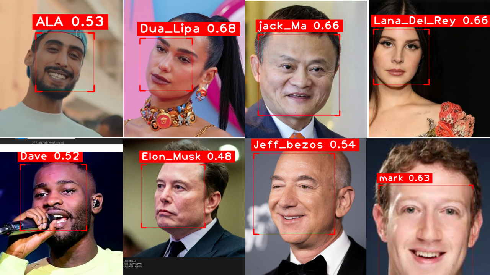
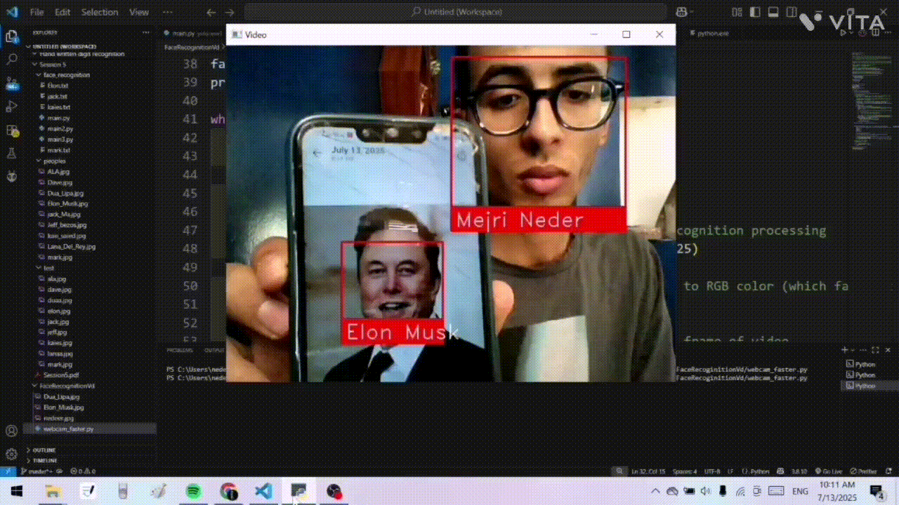

# 🧠 Real-Time Face Recognition with OpenCV and Face_Recognition  


## 🔍 Overview  
This project demonstrates a real-time face recognition system using the powerful combination of `face_recognition`, `OpenCV`, and `cvzone`. It loads a dataset of known individuals, encodes their facial features, and then performs real-time matching against test images. When a match is found, the system displays the recognized person’s name along with a confidence score and draws a bounding box around the detected face.

## 🎯 Objectives  
Key goals achieved in this project include:  
* **Face Dataset Loading**: Automatically load and process images of known individuals from a specified folder.  
* **Encoding Facial Features**: Use the `face_recognition` library to encode faces into numerical vectors for comparison.  
* **Real-Time Face Detection**: Load test images and perform detection, matching them against known faces.  
* **Name and Confidence Display**: Overlay the matched person’s name and recognition confidence score on the image using `cvzone`.  
* **Visual Enhancements**: Use bounding boxes and styled rectangles for better user readability and presentation.

## 📂 Dataset Description  
### 📁 Reference Dataset  
- Folder: `peoples/`  
- Contains labeled images (e.g., `Elon_Musk.jpg`, `jack_Ma.jpg`, etc.)  
- These serve as the known identities the model will compare against.

### 📁 Test Dataset  
- Folder: `test/`  
- Contains unlabeled test images to evaluate the recognition performance.  
- Each test image is scanned for faces and compared with the reference encodings.

### 📝 Naming Convention  
- File names in `peoples/` should follow the format: `First_Last.jpg`, as the system extracts the name from the filename automatically.

## 🧾 File Descriptions  
- **`face_recognition_script.py`**: The main Python script for encoding known faces and running recognition on test images.  
- **`peoples/`**: Folder containing reference images of known people.  
- **`test/`**: Folder containing test images used for face matching.  
- **`README.md`**: This documentation file explaining how the project works.  
- **`face_recognition_demo.png`** *(optional)*: A screenshot or output showing successful recognition results.

## 🚀 Getting Started  

### 1️⃣. Clone the Repository  
```bash
git clone https://github.com/yourusername/face-recognition-opencv.git
cd face-recognition-opencv
```

### 2️⃣. Install Dependencies  
Make sure you have Python 3.7+ and install the required packages:  
```bash
pip install face_recognition opencv-python cvzone
```

### 3️⃣. Prepare Image Folders  
Place your known reference images in:  
```text
peoples/
```
And your test images in:  
```text
test/
```

### 4️⃣. Run the Script  
```bash
python face_recognition_script.py
```

### 5️⃣. View Results  
The script will display the test image(s) with bounding boxes and names for any recognized faces. Press any key to close the window.

## 🧠 Behind the Scenes  
- Face encodings are 128-dimensional vectors.
- The `compare_faces` function calculates similarity and returns matches.
- A confidence score (inverse of face distance) is computed and displayed.
- Visual feedback is enhanced using `cvzone`'s modern overlays.

## 📸 Example Output  
This GIF showcases our algorithm running in real-time:

 
